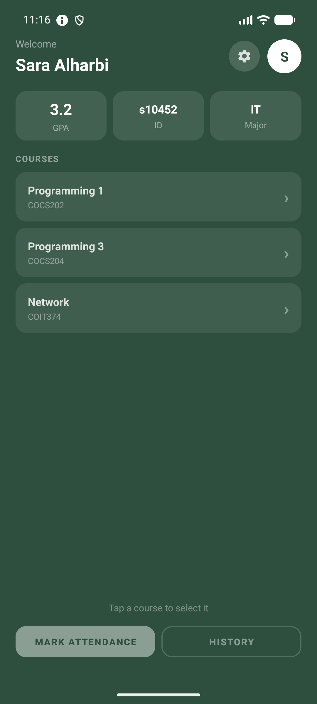
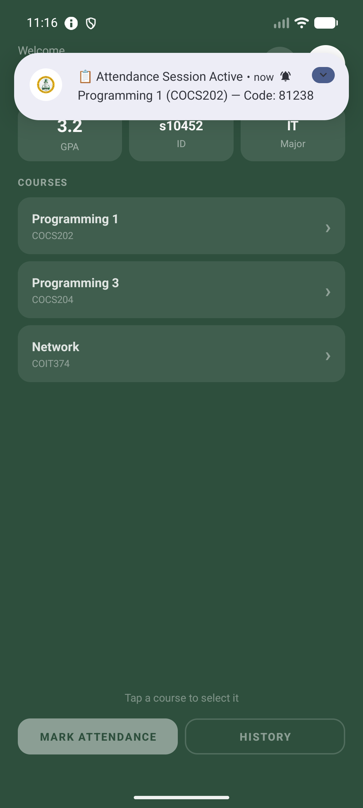
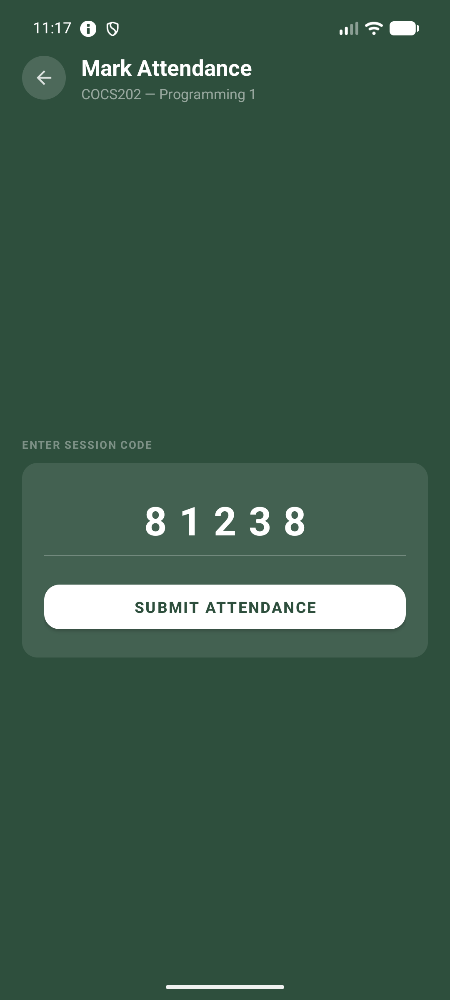
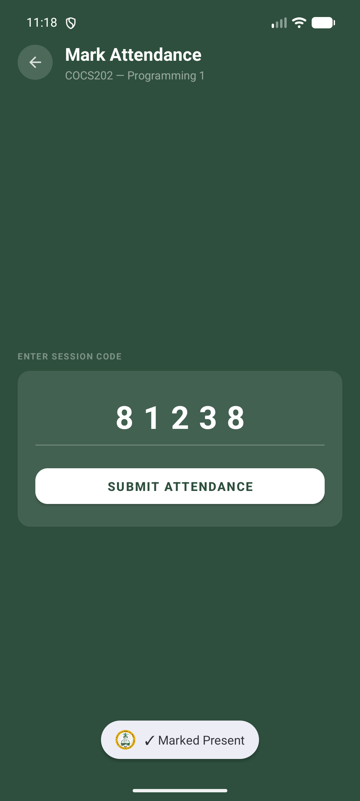
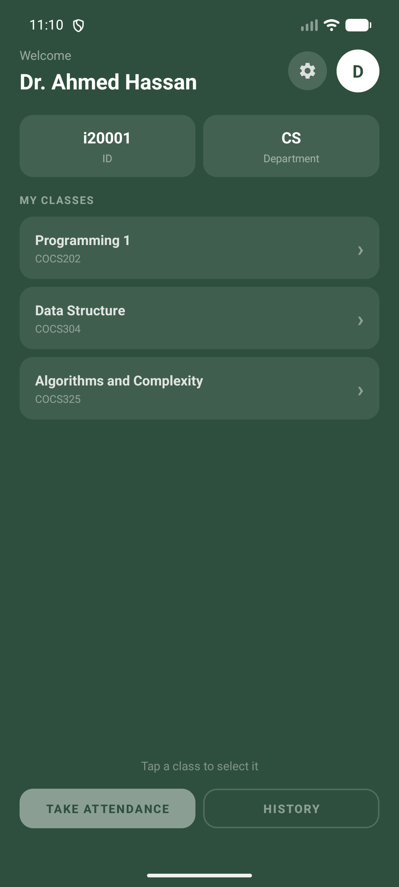
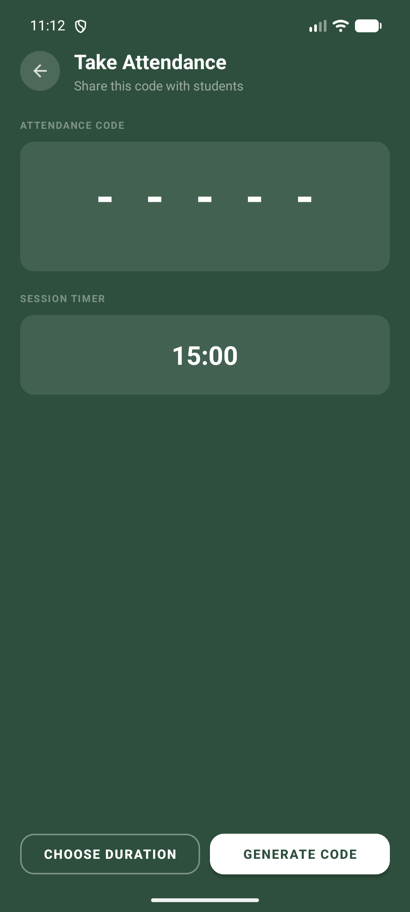
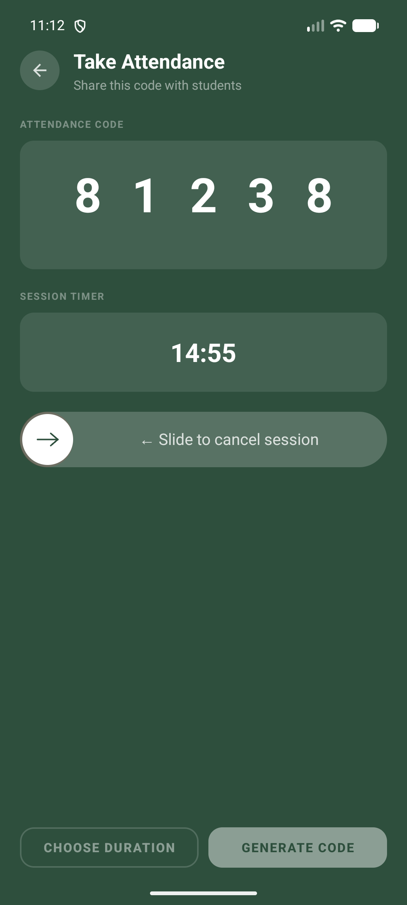
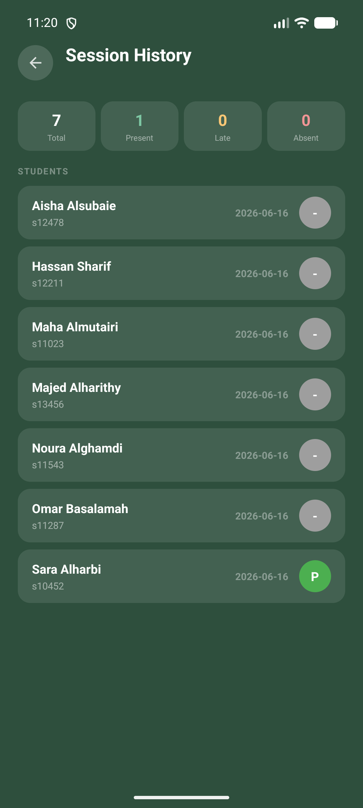

# 📲 AMS — Mobile Attendance Management System

A mobile-based attendance system for university classrooms, built as a graduation
project at **King Abdulaziz University (KAU)** — Faculty of Computing & Information
Technology, Rabigh (FCITR).

Instructors start a timed session that generates a short code; students mark
themselves present from their phones in seconds. The app decides **Present / Late /
Absent** automatically — replacing the 10–15 minutes typically lost to manual
roll-call in large lectures.

---

## ✨ Features

- **Role-based login** for students and instructors (server-side authentication)
- **One-tap attendance** using a timed 5-digit session code
- **Automatic Present / Late / Absent** based on submission time
- **Live countdown** on the instructor screen with a foreground service that
  survives screen changes, plus a *slide-to-cancel* control
- **Push-style notifications** that auto-fill the code for the student
- **Attendance history** for both roles, broken down per session
- **Bilingual UI** (English / Arabic)

---

## 📱 Screenshots

### Student
| Home | Session alert | Enter code | Confirmed |
|---|---|---|---|
|  |  |  |  |

### Instructor
| Home | Choose duration | Active session | History |
|---|---|---|---|
|  |  |  |  |

---

## 🏗️ Architecture

A three-tier design:

```
Android app (Kotlin)  ──HTTPS──►  Oracle APEX / ORDS REST API  ──►  Oracle Database
   Retrofit + Gson                  PL/SQL stored procedures           (Oracle Cloud)
```

**Attendance flow**

1. Instructor picks a duration (1 / 3 / 5 / 10 / 15 min) → `POST start/`
2. The server issues a 5-digit code and stores two cutoffs: `end_time` (80%) and
   `expires_at` (100%)
3. The student app detects the active session and shows a notification with the code
4. Student submits → `POST attend/` validates and records in one atomic transaction
5. When the timer ends → `POST close_session/` marks every non-attendee **Absent**

**How Present / Late / Absent is decided** (server-side, so the device clock can't game it):

| Submitted | Status |
|---|---|
| before 80% of the duration | **Present (P)** |
| between 80% and 100% | **Late (L)** |
| after 100% | rejected (expired) |
| never submitted | **Absent (A)** at close |

---

## 🗄️ Database

Six related tables on Oracle Database:

| Table | Purpose |
|---|---|
| `USERS` | accounts & profiles (id, role, name, email, …) |
| `COURSES` | course catalog |
| `SECTIONS` | a course taught by an instructor |
| `SECTION_ENROLLMENTS` | which students are in each section (junction table) |
| `ATTENDANCE_CODES` | one row per session (code, cutoffs) |
| `ATTENDANCE_RECORDS` | one row per attendance mark (status, timestamp) |

All timestamps are stored in **Asia/Riyadh** time for consistency.

---

## 🛠️ Tech Stack

- **Language:** Kotlin · **UI:** Android Views + Material Components
- **Networking:** Retrofit 2 + Gson · **Min SDK:** 27 · **Target SDK:** 36
- **Backend:** Oracle APEX REST (ORDS) · **Database:** Oracle DB (Oracle Cloud)

---

## ▶️ Building

1. Clone the repo and open it in **Android Studio**.
2. This project was scaffolded with the **Google Services** Gradle plugin (Firebase
   was set up but the app authenticates through the Oracle backend, not Firebase).
   `google-services.json` is intentionally **not** committed. To build, either:
   - drop your own `app/google-services.json` into the project, **or**
   - remove the `google-services` plugin and the `firebase-auth` dependency from
     `app/build.gradle.kts`.
3. Run on an emulator or device (Android 8.1 / API 27 or newer).

> The backend is a hosted Oracle APEX endpoint configured in `RetrofitClient.kt`.

---

## 📄 Project Documents

- [Final Report (PDF)](docs/AMS_Final_Report.pdf)
- [Presentation (PPTX)](docs/AMS_Presentation.pptx)
- [Technical Guide (PPTX)](docs/AMS_Technical_Guide.pptx)

---

## 👥 Team

Graduation Project — Computer Science, KAU / FCITR (2025–2026)

- Abdulaziz Othman
- Ali Almejalli
- Alwaleed Alghamdi

**Supervisor:** Dr. Nashwan Alromema

---

## 📝 Note

This repository is an academic graduation project. The bundled demo accounts and the
unused Firebase configuration have been removed from version control.
